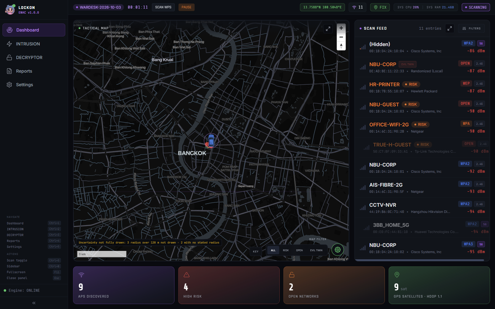
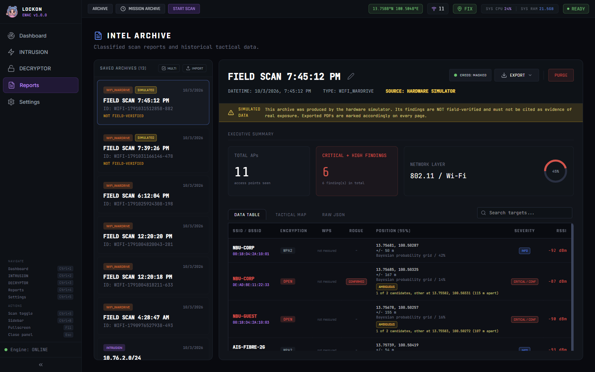
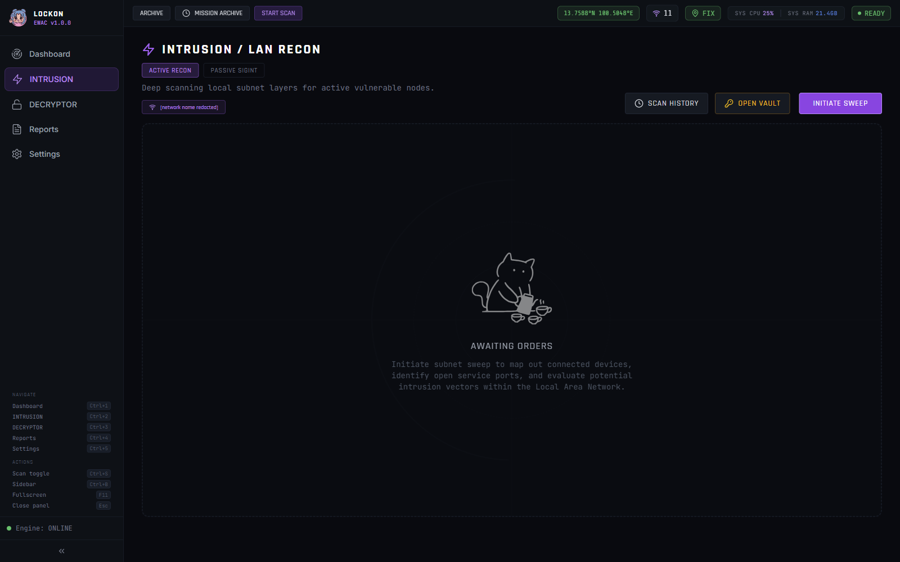
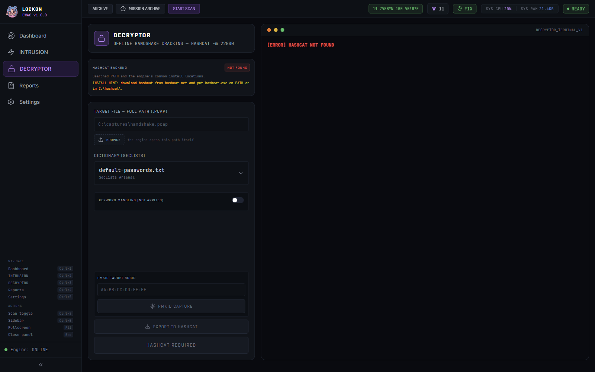
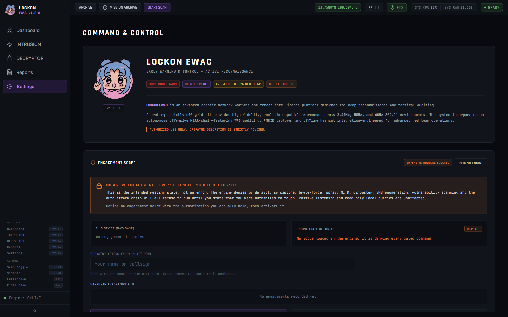

<div align="center">
  

  <h1>LOCKON EWAC</h1>

  <p>
    <a href="https://github.com/Meow-011/LOCKON-EWAC/actions/workflows/ci.yml"></a>
    
    
    
    
    
  </p>
</div>

**LOCKON EWAC** (Early Warning And Control) is a tactical desktop application designed for network reconnaissance, LAN intrusion analysis, and "Wardriving" operations.

Built with an ultra-responsive Next-Gen UI simulating a military command center, LOCKON combines the high-performance execution of **Rust (Tauri v2)**, the visual richness of **React 19 / Vite 7**, and the deep networking capabilities of **Python** - the engine frozen by **PyInstaller** and delivered with the app as one [`lockon-ewac-setup.exe`](https://github.com/Meow-011/LOCKON-EWAC/releases/latest)
built with **Inno Setup 7**. Nothing else is needed on the machine: no Python, no Node, no runtime to install first, no account, no cloud.

**What the whole thing is built around: the report has to survive being
questioned.** Every estimated position carries an error radius and says so when
it could not be established at all; every coverage figure states what it did not
reach; and the engine refuses offensive commands until an engagement scope is
active, recording each refusal in an audit trail the report prints. A confident
wrong answer does more damage than a crash.

## The five screens

<p align="center">
  <a href="docs/images/dashboard.png"></a>
  <a href="docs/images/reports.png"></a>
  <a href="docs/images/intrusion.png"></a>
  <a href="docs/images/decryptor.png"></a>
  <a href="docs/images/settings.png"></a>
</p>

<p align="center">
  <sub>Dashboard&nbsp;·&nbsp;Reports&nbsp;·&nbsp;INTRUSION&nbsp;·&nbsp;DECRYPTOR&nbsp;·&nbsp;Settings — click any for full size</sub>
</p>

Taken from the running application by `npm run previews`, not drawn. The survey is
simulated — `SIMULATION OVERRIDE` drives invented access points along a route from
a fixed public coordinate, so no real network or location appears. The joined-network
chip on INTRUSION reads `[network name redacted]`; nothing else was altered.

**[Install and build →](docs/INSTALL.md)** · **[What it does →](#key-capabilities)**

> **Lore & Origin:** The designation **EWAC** is heavily inspired by the highly-specialized "Reconnaissance Mobile Suits" of the *Mobile Suit Gundam* universe. Across various factions from the Earth Federation's **RGM-79EW EWAC GM** and **EWAC Jegan** to the Principality of Zeon's **MS-06E Zaku Reconnaissance Type**, these units operate in the shadows. Equipped with massive radomes and passive radar systems, they gather critical intelligence on enemy disposition without giving away their own positions. Much like its namesakes, LOCKON serves as a tactical data-gathering platform, sweeping the local area for unseen network signals and vulnerabilities before a strike.

<div align="center">
  
</div>

## Key Capabilities

### Wardriving Module
- **Real-time AP Discovery:** Passive 802.11 Access Point scanning with instantaneous vulnerability assessments (OPEN / WEP / WPA downgrades / WPA3 identification) and 5 GHz / 6 GHz spectrum awareness.
- **Driver-accurate security fields (Windows):** authentication string, pairwise cipher, 802.11 generation and **associated-station counts** come from `netsh wlan show networks mode=bssid`, because PyWiFi's Windows backend reports cipher as `NONE` for every network and calls a WPA3-Personal AP "WPA2". `cipher` and `auth_type` had been declared in the schema and the types all along and were never once populated; WPA3 networks were being understated as WPA2 in the report and fed to the rogue-AP scorer as such. Station counts are a client census with no monitor mode. Localized `netsh` output yields nothing rather than a half-filled record — gaps scattered through a scan look like findings.
- **Expanded scan feed:** the compact card beside the map is for glancing at while driving; expanded, it becomes a table carrying signal trend, cipher and authentication, band/channel/radio, client count, estimated distance, first/last seen, and **the reasons behind a risk verdict** rather than an orange chip. Only the access point this machine is associated with carries an address — a beacon is layer 2 and has no IP, so every other row says so instead of showing a blank that reads like missing data.
- **WPS Detection:** Automatic extraction of WPS lock state and version directly from 802.11 beacon tags.
- **Tactical Map Replay:** MapLibre-GL integration that tracks NMEA GPS signals and visualizes network density overlays along your driving route.
- **AP Location Estimators** (`src/lib/localization.ts`, regression-tested against simulated ground truth — see *Localization Accuracy* below):
  - **Likelihood Grid** *(default)* — grid search for the position that best explains every reading, so it can place a transmitter **off** the surveyed path. Most accurate of the three on every route measured, and the only one that still works from a single straight pass. Reports an error radius in metres and flags a mirrored candidate when the route cannot rule one out.
  - **Track Position** — signal-weighted average of the sighting positions. A convex combination of points you drove through, so it **cannot leave the path that was driven**. Fast; a sanity baseline, not a transmitter fix.
  - **Multilateration** — least-squares fit of modelled ranges, solved to convergence. Can leave the path, but needs more sightings and a route with real shape before it beats the grid.
  - **None of the three runs without a baseline.** Below `MIN_ALONG_TRACK_M` (25 m of travel) `estimateLocation` refuses *before* dispatching to any method and returns a position marked unresolved, because no search can recover a position the geometry does not contain. Until v1.0.0 the estimators ran anyway, and the result was not merely imprecise but unstable — a few dB of fading moved it tens of metres, so access points visibly crawled around the map. A stationary survey now groups them into one counted marker per place the operator stood, and says to drive past them.
  - Every estimate carries the **route geometry** it was derived from and its caveats, and all three use a **frequency-corrected** path loss model. Two of the three also carry an **error radius**; Track Position deliberately does not, because a convex combination of the sighting positions has no meaningful uncertainty to quote.
  - **Live preview** under Settings → RF Tuning drives a synthetic route past a transmitter at a known position and runs the *real* estimator over the sightings — not an illustration, so it cannot drift from the code. Toggling between a straight pass and a route with one turn is the quickest way to see why mirror ambiguity exists: on the straight pass the panel draws both equally good candidates and states the separation.
- **GPS Quality Pipeline:** Four stages, each of which exists because it was once missing and something wrong was drawn on the map:
  - **Fix validity** — GGA's `gps_qual` and RMC's `status` are read, which nothing did until v1.0.0. A receiver with no fix still emits sentences and still fills in a latitude, and one that *loses* lock keeps emitting them and overwriting the last good position. That is where a parked vehicle got both a moving track and a heading.
  - **HDOP Filter** — Rejects readings with poor satellite geometry (HDOP > 5.0).
  - **Speed Outlier Detection** — Haversine-based filter rejecting GPS jumps exceeding 200 km/h.
  - **Movement threshold** — a fix joins the track only once it is `GPS_STEP_M` (5 m) from the last one. Not cosmetic: the track **is** the baseline the estimators trilaterate from, so recording stationary scatter as travel hands them a survey geometry that does not exist.
- **OUI Vendor Identification:** Built-in Scapy `manufdb` integration providing offline lookup for over 35,000+ IEEE MAC manufacturer assignments. Capable of detecting Randomized (Locally Administered) MAC addresses.
- **Sonar Audio System:** Configurable synthetic audio telemetry (Web Audio API) delivering sonar pings to alert operators of nearby targets without requiring line of sight to the dashboard.
- **Evil Twin Detection:** Heuristic-based detection of SSIDs broadcasting with conflicting encryption types.


---

### INTRUSION / LAN Recon Module
- **Multi-Subnet Auto Discovery:** Automatically detects all active network interfaces (Wi-Fi, VMware, Hyper-V, Mobile Hotspot) and parallelizes scans across all subnets simultaneously.
- **ARP-Based Host Validation:** Pre-filters alive hosts via ARP cache before port scanning - eliminates false positives from NAT/ICS ghost responses.
- **Smart Port Scanning:** three modes — `QUICK` (9 ports), `DEEP` (36 TCP + 7 UDP, plus SSL analysis, SNMP community testing and a default-credential check), `STEALTH` (shuffled order, one port at a time, randomized gaps). Every probe goes through a shared pool capped at 128 concurrent sockets. The sweep reports how much of the range it actually probed: the ARP pre-filter can reduce a /24 to a handful of addresses, and `intrusion_scope` states `addresses_in_range` against `addresses_probed` so a narrow sweep is never read as a clean result.
- **TTL-Based OS Fingerprinting:** Analyzes ICMP TTL values to classify hosts as Windows / Linux / Router without admin privileges.
- **Web Title Grabbing:** Extracts HTML `<title>` from HTTP/HTTPS services for intelligent device identification (routers, NVRs, IoT gear).
- **MAC Address & Hardware Vendor Resolution:** Retrieves MAC via `ipconfig /all` (local NICs) and ARP cache (remote hosts), with Locally-Administered bit stripping for accurate OUI vendor lookup.
- **Scan History Diff Detection:** Compares current vs. previous scan results to detect newly appeared and disappeared devices in real-time.
- **Context-Aware Vulnerability Matrix:** Port-to-CVE mapping that factors in OS version and service banner - only flags EternalBlue on legacy Windows 7, only flags BlueKeep on pre-NLA systems.
- **Offline CVE Intelligence Engine:** A localized, high-speed vulnerability lookup engine that maps raw service banners (e.g., Apache 2.4.49, vsftpd 2.3.4) against a curated matrix of high-impact Common Vulnerabilities and Exposures (CVEs) without requiring internet access.
- **Intelligent Risk Scoring:** Dynamically styles UI elements (IP colors, port badges) based on the calculated threat level from the CVE database rather than generic open ports.
- **VPN/Overlay Filtering:** Automatically excludes Tailscale (CGNAT 100.64+), WSL/Docker (172.31.x) subnets from auto-discovery to reduce scan noise.
- **STRIKE (Countermeasures):** Targeted IEEE 802.11 Deauthentication module (Deauth Jamming) to forcefully disconnect unauthorized or compromised nodes from the network.
- **SSL/TLS Deep Scan:** Full certificate chain analysis including expiry, self-signed detection, weak cipher audit, deprecated TLS 1.0/1.1 probing, and HSTS verification.
- **Visual Traceroute:** hop-by-hop path to a host via the platform's `tracert`, with per-hop latency, reverse DNS, and an analysis pass that flags a NAT boundary, a run of filtered hops, a latency spike, and whether the target answered at all. It carries into the report as a *Network Path Context* section rather than as findings — a NAT boundary describes the route, not a weakness in it. There is no TTL readout and no geolocation; both were claimed here and neither exists.
- **VLAN Detection:** 802.1Q tagged frame analysis to discover network segmentation and identify cross-VLAN access opportunities.


---

### Reports & Archive
- **Exports are one grouped menu, and the two controls that are not exports stay out of it.** PDF, CSV, JSON, KMZ, GeoJSON and the audit trail live under a single `EXPORT` menu grouped by what the reader of the file will do with it. The map export is a KMZ rather than a KML because the two placemark icons travel inside it: as hrefs they were fetched from Google over plain HTTP, which meant a cleartext request leaving the client's machine at the moment they opened the assessment. The credential-disclosure toggle sits outside it because it is a mode that decides whether recovered passwords leave the building in cleartext, and its state has to be legible at the moment of export rather than hidden one click away — it is also repeated on the PDF row inside the menu. `PURGE` sits outside it, behind a divider, because it is irreversible. Spatial exports are disabled with the reason shown for a LAN sweep, which has no coordinates in it, rather than accepting the click and answering with a toast.
- **Persistent Asset Database:** Native SQLite persistence layer (`ewac.db`) for all intel reports, credentials, and host discovery state. Prevents `QuotaExceededError` from local storage limitations and ensures enterprise-scale data integrity.
- **Gaussian Process Regression (GPR) Smoothing:** An optional `scikit-learn` post-processing pass over an archived mission. It fits a smooth surface through the RSSI values that were *measured* and returns its peak, which suppresses the noise spikes that make a raw peak-RSSI position jump around. **It is a de-noised "where was the signal strongest", not a transmitter fix** — every measurement comes from wherever the operator drove, so the fitted surface only exists over that path and its maximum can only lie on or near it. It reports an error radius in metres. See *Localization Accuracy*.
- **Comprehensive Intelligence Reports:** Select multiple missions across both Wardriving and LAN Recon to aggregate them into a single, massive PDF deliverable, complete with an **Interactive Clickable Table of Contents**.
- **In-App PDF Viewer:** Exported PDF reports can be previewed immediately within the app via a full-screen modal overlay, providing seamless intelligence review without relying on external PDF viewers.
- **Dynamic Network Context:** Automatically captures and appends Wi-Fi SSID context to subnet archives in the background, making historical analysis significantly easier.
- **Tactical Intelligence Archive (Scan History):** A fully-featured archive UI with inline accordion details, session filtering, Quick Re-Scan actions, and visual dimming of empty sweeps to prioritize high-value targets.
- **Mission Debriefing:** Structured report generation with risk scoring, professional branding (Blue/Pink tactical palette), and remediation guidance.
- **100% Offline-First Privacy:** All recon data, GPS logs, and network footprints are stored strictly on the local SQLite database. Absolutely zero cloud telemetry, ensuring total operational security (OPSEC).


---

### Passive SIGINT Radar (New)
- **Zero-Emission Reconnaissance:** Monitor network activity completely passively without sending a single packet, evading IDS/IPS detection.
- **LAN Host Discovery:** Analyzes ARP, DHCP, and mDNS broadcast packets to identify hosts, IP addresses, and hostnames stealthily.
- **WiFi Probe Monitoring:** Captures 802.11 Probe Requests to track nearby client devices, profiling their historical network connections and tracking physical movement.


---

### Engagement Scope & Audit Trail

**The commands that can cause harm are gated. With no active engagement scope, none of them runs — this is the intended resting state, not a fault.**

The boundary is drawn at *harm*, not at *emission*. Reconnaissance emits packets
too, but a misdirected port sweep inconveniences nobody and leaves nothing
behind; a misdirected deauthentication drops somebody's connection, an ARP spoof
redirects their traffic through this machine, and a spray can lock out accounts
that were never part of the engagement. Those are the acts that need an
authorization record behind them, and gating only those keeps the audit trail
short enough that the entries which matter are actually read.

- **Operator-defined allowlist:** an engagement records who authorized it, the reference (ticket/document), an optional expiry, and the exact targets in scope as `BSSID`, `SSID`, `IP` or `CIDR` entries. Defined under **Settings → Engagement Scope**.
- **Enforced in the engine, not the UI:** the gate lives in `engine/policy.py` and runs before the module that would send the traffic. The UI can be bypassed by anything that writes to the sidecar's stdin; "the operator clicked the right button" is not something a report can stand on.
- **Strict matching:** BSSIDs match regardless of separator or case; an IP matches an exact entry or any allowlisted CIDR; and a requested subnet must be a *subset* of an allowlisted range, so asking to sweep `10.0.0.0/8` does not pass on the strength of an allowlisted `10.0.5.0/24`. Every target of a command must pass — a MITM authorized for the victim but not the gateway is still out of scope.
- **One access point, either name.** An SSID entry authorizes every access point broadcasting it, so an estate of hundreds of radios is two or three lines rather than a wall of MAC addresses. This did not work until 2026-09-27: the per-AP commands passed only a BSSID to a check that requires *every* entry to match, so SSID entries matched nothing for capture and PMKID and the allowlist genuinely was impractical. `ScopePolicy.authorize_ap()` now accepts either identifier for the same radio; `authorize()` is unchanged, because requiring every entry is correct when the entries really are different subjects.
- **LAB / MY OWN NETWORK:** a one-click UNRESTRICTED engagement for your own equipment, behind a single confirmation that states what is being claimed. It removes the typing, not the decision — the acknowledgement exists so the claim is made consciously.
- **Audit trail:** every allow and every block is written to `audit_log` with the command, target, decision, reason and operator, and both appear in the exported PDF. The blocked rows are evidence that the rig declined out-of-scope targets.
- **UNRESTRICTED mode** exists for lab and own-network use. It requires a typed acknowledgement, is never the default, and is stated plainly on the report — it is still fully audited.
- **Fails closed:** an expired engagement, an unparseable expiry, or a command carrying no identifiable target are all refused.

**Gated** (five): `auto_attack`, `start_strike`, `start_mitm`, `start_spray`, `start_bruteforce`. `auto_attack` is here for a second reason on top of the harm it can do: it is the only command that selects its own targets, so the gate is the only thing between it and a neighbour's access point.

**Not gated:** reconnaissance and capture — `start_intrusion`, `start_vuln_scan`, `start_smb_enum`, `start_deep_ssl_scan`, `start_vlan_detect`, `start_traceroute`, `start_dirbuster`, `start_capture`, `start_pmkid_capture` — along with passive listening (`start_passive`, `start_probe_monitor`) and read-only local queries.

Two consequences worth stating, both of which the report now says out loud:

1. **The audit trail is evidence about the gated set, not a complete log of everything the tool did.** An ungated command writes no audit row. It still emits packets.
2. **Findings are not filtered by scope.** Passive observation is unrestricted by design, so an access point belonging to a neighbouring tenant can appear in a report, and nothing marks a finding as in or out of scope.

The list lives in `GATED_COMMANDS` in `engine/policy.py`, `describe()` publishes it, and the report generates its claim about refusals from what it publishes — so the document cannot drift from the code. `test_policy.py` pins both halves: that the five harmful commands stay gated, and that reconnaissance stays ungated.


---

### Evidence Integrity

The output of this tool is a report someone acts on, so the data behind it has to be traceable:

- **Simulator runs are flagged.** `is_simulated` is recorded on missions, access points, scan logs, sessions, reports and cracking history. The PDF marks it on the cover, in the executive summary, in the targets list and in every page footer, and a mixed export names which operations were which.
- **No fabricated measurements.** The dashboard's satellite count, the decryptor's hash rate/temperature/ETA, and capture success are all read from real sources. Where a value is unavailable the UI shows a dash instead of a placeholder.
- **Credentials are masked in the PDF by default**, with an explicit opt-in for a full-disclosure export that marks itself as containing cleartext.
- **The audit trail and engagement scope are not purgeable** — REVIEW & PURGE in Settings clears collected data only, and says so.
- **Artifacts are hashed and registered.** Captures are written to a fixed evidence directory (`%LOCALAPPDATA%\LOCKON-EWAC\evidence`), SHA-256'd at the moment of writing, and recorded in `evidence_files` so a finding can cite the file that backs it. `verify_evidence` can re-hash them on demand to show a file is unaltered, though nothing in the UI currently sends it — see the known gaps. Previously a capture landed in whatever directory the sidecar started in, unhashed and unreferenced.
- **The exported report carries its own digest.** The PDF's SHA-256 is computed at export, stored on the report row with who exported it and when, and printed in the document.


---

### Risk Methodology

Severity comes from one rule set (`src/lib/riskEngine.ts`) and every finding records **why**.

This replaced five separate rule sets that disagreed with each other — badly enough that one PDF could count a WPA1 network in its headline "vulnerable" figure while printing that same network as `[LOW]` in the table below it. `vulnerability_results`, `RISK_THRESHOLDS` and `risk_score` all existed in the schema and were never written, so the Reports page's LAN vulnerable count filtered on an always-null column and was permanently zero.

- **Five levels** (CRITICAL/HIGH/MEDIUM/LOW/INFO) from a 0-100 score, with the bands printed in the report so a label can be checked.
- **Confidence is separate from severity.** A suspected rogue AP is a high-severity finding at low confidence, not a low-severity one — a reader needs both facts. `CONFIRMED` means directly observed; `LIKELY` means inferred from strong evidence such as a version banner but not exercised; `SUSPECTED` means indicators present but insufficient to assert.
- **Findings persist with a stable fingerprint**, so a retest recognises the same issue instead of reporting everything as new. A finding seen again after being closed becomes `REGRESSED`.
- **CVE findings say they were banner-matched, not exploited**, and carry the age of the CVE data they came from.


---

### Rogue AP / Evil Twin Detection

Indicator scoring (`engine/scanner/evil_twin.py`), not a single rule, because the single rule was wrong in the environments this tool is pointed at.

The previous heuristic was "same SSID with two encryption types → both are evil twins", which meant **every organisation running WPA2/WPA3 transition mode would have been reported as operating evil twins** — a false accusation aimed at a correct modern configuration. It also flagged the legitimate AP and the impostor identically, and could not see the attack it was named after (a clone that matches the encryption and differs only in hardware).

- Seven weighted indicators: open clone of a secured SSID, vendor/OUI mismatch, encryption downgrade, unexpected encryption split, channel conflict, signal outlier, locally administered MAC.
- Group-level indicators attach to the **deviating** AP, not to every AP sharing the SSID, so the victim is not accused alongside the rogue.
- WPA2/WPA3 transition and legacy mixed mode are recognised as legitimate and score nothing.
- Verdicts are `CLEAR / SUSPECTED / LIKELY / CONFIRMED`; only LIKELY and above set the flag that reaches the report. `describe_methodology()` ships the weights, thresholds and stated limitations into the report appendix.


---

### Localization Accuracy

Measured, not asserted. `tests/localization.test.mjs` and `engine/tests/test_gpr.py` run a simulated drive — transmitter 40 m off a road, 300 m pass, 6 dB shadowing — and assert on the error in metres, so a regression shows up as a number.

**What the estimators scored before this was tested:**

| method | error | what was actually wrong |
|---|---|---|
| peak RSSI (baseline) | 40.7 m | — the number every method has to beat |
| weighted centroid | 40.6 m | off-track displacement **0.0 m in every trial**: a convex combination of collinear points is mathematically stuck on the line |
| trilateration | 38.6 m | solver ran 10 fixed gradient steps and stopped at **~65% convergence**; it also seeded from a hash of the BSSID, so part of every coordinate came from the MAC address |
| bayesian grid | 16.7 m | but picked the **wrong side of the road in 2 runs out of 5** and reported no uncertainty |
| GPR "sub-metre" | **225.4 m** | prior mean of 0 dBm (stronger than any real reading) plus a grid padded 55 m past the data, so the peak escaped outside the surveyed area — while reporting 69% confidence |

**After:** multilateration **66–79% better** where geometry allows; GPR **225 m → 40 m**; 5 GHz APs no longer placed 1.80x too far away (6 GHz 2.13x); every estimate now carries an error radius that was verified to cover the real error.

#### The transmitter's power is unknown, and that was not accounted for

Everything above simulates a transmitter whose power is exactly the constant the
estimator assumes: `-40 dBm at 1 m`. That makes it a test of the *search*, not of
the *model*. Real equipment is nowhere near that uniform — an enterprise access
point at full EIRP against a phone hotspot is well over 10 dB apart before
antenna gain — and a passive survey cannot tell which one it is looking at.

A power error does not merely widen the answer. Every modelled distance scales by
the same factor, so the fit slides the transmitter toward or away from the road to
compensate. Measured on a route with one turn, 200 trials per cell:

| real power vs assumed | median error, before | stated radius covered the truth |
|---|---|---|
| exactly as assumed | 9.3 m | 98% |
| 3 dB of spread | 13.5 m | 77% |
| **6 dB** | **18.1 m** | **52%** |
| 10 dB | 25.3 m | 43% |

The report prints that radius as "roughly 95% of the posterior". At the ordinary
case of a few dB it was covering half the time.

**The obvious fix made it worse, which is why it is not what shipped.** Fitting the
power freely — profiling it out of the likelihood, so the estimate depends only on
the *shape* of the signal along the route — is invariant to EIRP by construction.
Measured, it flattens the likelihood surface enough that the estimate runs away:
on the turn route with the power known it went from 9.3 m to 22.2 m and coverage
from 98% to 53%, with a p90 error of 202 m.

What shipped instead is a prior. The power may move by `POWER_PRIOR_DB` (2 dB,
chosen from the sweep below), and the stated radius is widened by the positional
error that `TX_POWER_SPREAD_DB` (6 dB) of unmodelled difference would induce —
proportional to the estimate's distance from the nearest sighting, because that is
how the error actually scales. Both constants are published in the report's method
appendix.

| real power vs assumed | median before | median after | coverage before | coverage after |
|---|---|---|---|---|
| exactly as assumed | 9.3 m | 11.4 m | 98% | **100%** |
| 3 dB | 13.5 m | **11.7 m** | 77% | **96%** |
| 6 dB | 18.1 m | **13.9 m** | 52% | **94%** |
| 10 dB | 25.3 m | **16.8 m** | 43% | **89%** |

It costs two metres when the assumption happens to hold — which it never exactly
does — and returns four to eight when it does not, while making the radius mean
what it says.

#### Route geometry decides what is possible

With every sighting on one straight line the likelihood is symmetric about that line, so **which side the transmitter is on cannot be determined**. Measured over five noise seeds per route:

| route | median error | wrong side |
|---|---|---|
| single straight pass | 31 m | 2 of 5 |
| **same street driven twice** | 25 m | **5 of 5** |
| two parallel streets | 13 m | 0 of 5 |
| **route with one turn** | **5 m** | **0 of 5** |
| loop around the block | 14 m | 0 of 5 |

**Driving the same street again makes it worse, not better** — a second pass only reinforces the symmetry. One turn resolves it. The app detects this geometry, records it per AP, and the report names both candidate positions and their separation rather than showing one dot for a coin flip.

#### What the three selectable methods score today

Same harness, median absolute error over five noise seeds:

| route driven | Likelihood Grid | Multilateration | Track Position | Peak RSSI |
|---|---|---|---|---|
| straight, 300 m | **12 m** | 42 m | 40 m | 42 m |
| same street twice | **12 m** | 43 m | 40 m | 43 m |
| two parallel streets | 8 m | **7 m** | 10 m | 21 m |
| one turn (L-shape) | **15 m** | 23 m | 43 m | 43 m |
| loop around the block | **16 m** | 19 m | 20 m | 64 m |

The grid wins or ties on every route, which is why it is the default. It used
not to be: a fresh install defaulted to Track Position — the method whose own
description says it cannot leave the surveyed path and is "a sanity baseline,
not a transmitter fix" — so an operator who never opened Settings got exactly
that in their report.

#### Shape is not enough; scale is also checked

Consumer GPS scatter is roughly circular, which scores a near-perfect
cross/along ratio. The linearity test measured the shape of the cloud and never
asked how big it was, so a parked rig was told *"2 m of deviation across 5 m of
travel. Enough shape to determine which side of the track an AP lies on."* It is
not enough for anything.

| constant | value | what it rejects |
|---|---|---|
| `MIN_ALONG_TRACK_M` | 25 m | sightings that never travelled — a stationary receiver's scatter |
| `MIN_CROSS_TRACK_M` | 8 m | perpendicular deviation within GPS noise, however good the ratio |
| `LINEARITY_AMBIGUOUS_BELOW` | 0.15 | a route straight relative to its own length |

The two are deliberately separate. A dead-straight 165 m drive has zero
cross-track spread and plenty of baseline: it is mirror-ambiguous, not
stationary, and telling that operator to "drive past the access point" when they
just did would be worse than silence. Settings shows three states —
**STATIONARY**, **STILL A LINE**, **SHAPED** — and says which applies.

#### And below the baseline, nothing is estimated at all

For a long time `insufficientBaseline` was detected and then ignored: it set a
flag, wrote a note, tinted a label — and the estimator ran anyway. That answer
is not merely imprecise, it is **unstable**. Solving for a transmitter a hundred
metres away from a cluster of sightings ten metres across is ill-conditioned, so
a few dB of fading moves it tens of metres and the access points visibly crawl
around the map. Choosing Multilateration made it worse, because the most
geometry-hungry method degrades furthest when there is no geometry.

`estimateLocation` now gates **before** dispatch — not inside each estimator,
because no search can recover a position the geometry does not contain, and
three of them failing differently produced three wrong answers instead of one
honest refusal. What is reported instead is the mean of where the receiver
stood, marked `resolved: false`, with a radius from the strongest reading.

That radius needed correcting twice, in opposite directions. The peak of *n*
readings is the luckiest one, so the distance it implies is short by about
`sigma * sqrt(2 ln n)` — measured, the first version covered the true position
in **4 runs in 10**. Correcting it with the *single-reading* spread on top then
double-counted and gave 100% coverage at a median radius **4.2×** the error it
covered: a circle 1.4 km across for a transmitter 279 m away, true and useless.
Using the max-of-*n* spread gives **99.5% coverage at 2.3×**. Both bounds are
asserted, because they pull against each other and any radius covers if it is
made large enough.

On the map these group into **one numbered marker per place the operator
stood** — every unresolved estimate lands on the receiver, measured at 1.6 m
apart across twelve transmitters 30 to 300 m away, so individual dots would
stack into a pile that still implied twelve positions. Moving resolves it, and
the marker says so.

#### The peak fallback no longer understates itself

When there are too few sightings for anything better the estimate falls back to
the strongest reading, and it reported the modelled distance to the AP *as* its
error radius: 14 m of claimed uncertainty against 42 m of measured error,
printed in the report as a confidence bound. A distance derived from one reading
carries that reading's shadowing spread, so the radius is multiplied by
`SINGLE_READING_DISTANCE_FACTOR_95 = 10^(2 sigma / (10 n))` — about 3.0x — which
is derived from the model rather than written down, so it follows if sigma or
the exponent changes. Measured agreement after: 42/44, 64/69, 39/36 m.

#### The radio model

Reference power is corrected for frequency: 5 GHz reads about 6.5 dB weaker and 6 GHz about 7.8 dB weaker than 2.4 GHz at the same range, and using one reference for all three placed the higher bands far too distant. The absolute 2.4 GHz reference (-40 dBm at 1 m) is a rule of thumb, **not a calibration against measured hardware** — distances scale with it, so systematic error is possible. The relative band correction is physics and is reliable. All of this, including the confidence-to-metres mapping, is printed in the report's method appendix.

#### Cost

The grid search was 40 ms per AP, which is nine seconds of frozen UI to open a 200-AP archive. It is now ~6 ms: squared-distance arithmetic (no square root in the inner loop), typed arrays, the posterior reusing the search grid instead of a third pass, and a capped diverse subset of sightings. Live scanning is additionally bounded by a per-second estimation budget so a dense city block cannot saturate the render thread, and archive post-processing yields to the event loop as it goes.


---

### Survey Coverage

The report states what was surveyed, not only what was found — so "no vulnerable APs on the north side" can be told apart from "never drove the north side".

Recorded per mission (`mission_coverage`): distance travelled, duration, GPS fix count, bounding box, average/worst HDOP, average satellites, **GPS dropout count and longest gap**, and per-band AP counts. Distance deliberately excludes legs across a dropout, because a straight line drawn over a four-minute outage is not ground that was surveyed. HDOP and satellite count are now written to `scan_logs`; the engine always reported them and the UI always displayed them, but nothing stored them, so fix quality was unrecoverable after a drive.


---

### Hardware Readiness

`check_capabilities` probes Npcap, raw layer-2 capture, elevation and monitor-mode support, and Settings shows the result per feature with the reason anything is blocked.

This is the gap most likely to produce a *wrong* report. A deauth that silently sends nothing, or a ten-minute handshake capture on a managed-mode adapter, returns a null result that is indistinguishable from evidence that the target is secure. Until now the only precondition anything checked was whether scapy could be imported, which succeeds on a machine with no Npcap at all.

**Monitor-mode support is reported as "cannot be confirmed" on Windows rather than guessed.** Determining it for certain means switching the adapter, which is intrusive and can drop the operator's own connection — and a confident wrong answer here is exactly the failure this probe exists to prevent. Most built-in Windows adapters cannot do it; confirm with a short test capture against a known AP.


---

### Offline Field Operation

The map falls back to a bundled offline style when the basemap cannot load, and **keeps the AP markers and the GPS track**.

Previously every source and layer was registered inside MapLibre's `load` event, which never fires when the style request fails — so with no network the operator got a blank panel with no markers, no track and no error message, while the scan ran correctly behind it. There is now an `error` handler, an automatic fallback, a watchdog for the captive-portal case, and a visible banner stating that scanning and recording are unaffected.

**Nothing is fetched at startup any more.** The four interface typefaces are carried in the build rather than requested from Google: a security tool that opens a connection to a third party every time it starts is making a request somebody eventually has to explain, and the tool used to look like one application on a desk and a different one in the field. The shipped policy now names no font host at all.

**Cartography can be carried too.** Install a PMTiles archive and the offline map is a real map — coastline, roads and place names, read straight off the disk with no tile server. It is not shipped, because the right extract depends on where the work is: the planet is tens of gigabytes and a city is a few. **Settings → Offline Basemap** shows the path, whether the file was readable, and what it covers; [INSTALL.md](docs/INSTALL.md#the-offline-basemap-optional-and-worth-it) has the one command that produces one. Without an archive the offline style is still a plain backdrop with your markers and track on it.


---

### Client / Station Inventory

Probe requests and observed associations are kept (`clients`), so the obvious follow-up to a rogue-AP finding — *who was connected to it* — is answerable.

`probed_ssids` and `associated_bssid` are held strictly apart: seeing a probe proves a device was present and looking for that network, not that it connected, and only an association may be reported as a connection. Randomised (locally administered) MACs are flagged as such so an ephemeral identifier is never presented as a stable device identity.


---

### Offensive Operations (New)
- **AUTO-ATTACK CHAIN:** Autonomous background orchestrator that sequences clientless PMKID captures on high-signal WPA/WPA2 targets (RSSI ≥ -75dBm). **Every candidate is filtered through the engagement scope before a single frame is sent**, and anything it declines to touch is recorded as `BLOCKED` in the audit trail. Without an active scope it selects no targets at all.
- **GLOBAL CREDENTIAL VAULT:** A centralized SQLite-backed system for securely storing, tracking, and managing all credentials compromised during active operations.
- **BRUTE FORCE:** Active service credential testing using a multi-threaded engine against FTP, SSH, and HTTP services.
- **CREDENTIAL SPRAYING:** Automatically takes compromised credentials from the Vault and aggressively tests them against all other discovered nodes across the entire subnet in parallel.
- **TRAFFIC INTERCEPT (MITM) & DEEP PROTOCOL PARSING:** Performs Layer-2 ARP Spoofing to route target traffic through the EWAC engine. Features a high-speed custom **SNI Harvester** for encrypted HTTPS tracking, a **Cleartext Credential Sniper** (HTTP, FTP, Telnet), and 1-click **PCAP Evidence Export**. Engineered with a robust **3-Layer Routing Fallback** (sendp with interface -> sendp without interface -> Layer 3 auto-routing) to guarantee stability against WinPcap/Npcap adapter string resolution errors on Windows.
- **WEB SECRETS SCANNER:** Multi-threaded web enumeration engine designed to uncover exposed `.env` files, `.git/config` repositories, and `docker-compose.yml` internal architecture leaks.
- **SMB DEEP ENUMERATION:** Direct raw-socket interrogation of port 445. Retrieves NTLMSSP challenges to extract Windows OS build versions, Domain identities, tests for EternalBlue/SMBv1 via Null Sessions, performs **Share Discovery** with access-level checks (OPEN/DENIED), and analyzes SMB Signing configurations for relay risks. Built with a robust 15-second frontend timeout fallback.
- **PMKID CAPTURE & HASHCAT:** Clientless WPA/WPA2 handshake interception directly from the AP (RSN PMKID), with 1-click export to Hashcat-compatible `.hc22000` files for high-speed GPU cracking on external rigs.
- **DECRYPTOR (Offline Cracking):** EAPOL/PMKID captures are converted to `.hc22000` and cracked by a **real local hashcat install** (`-m 22000`), driven as a subprocess. Progress, hash rate, device temperature and ETA are parsed from hashcat's own `--status-json` output, so every number shown is measured rather than estimated. If hashcat is not installed the module refuses to start and says where it looked — it never falls back to a simulation.
- **Dictionary Arsenal:** Global wordlist management. Pre-loaded with common/optimized dictionaries (RockYou, Mirai, CIRT), with the ability to upload and persist custom `.txt` dictionaries via the UI.
- **Antenna Benchmarking:** A dedicated diagnostic tool to test Wi-Fi adapter efficiency. Performs multi-pass scans to analyze 2G/5G/6G channel coverage and maps RSSI signal strength distribution to evaluate hardware performance.


---

### System Hardening & UX
- **Zero-Error TypeScript Build:** 100% type-safe compilation with strict mode enabled. All IPC commands are mapped to the `EngineCommand` union **and `engineIPC.send()` is typed against it**, so a mistyped command name is a compile error rather than a silent "Unknown command" at runtime.
- **Auto-Reconnect Engine:** Exponential backoff reconnection mechanism for the Python sidecar with real-time UI feedback (reconnecting/reconnected/failed toast notifications).
- **Configuration Persistence:** Engine settings (COM port, baud rate, map style, location method, 3D/heatmap toggles) persist across app restarts via Zustand middleware.
- **Tactical Confirm Modal:** All destructive actions (delete wordlist, purge history, clear vault) use a branded animated modal instead of native browser dialogs.
- **Global Keyboard Shortcuts:** `Ctrl+1-5` page navigation, `Esc` close drawers/modals, `Ctrl+B` toggle sidebar, `Ctrl+,` settings, `F11` fullscreen, and **`Ctrl+S` start/stop a live wardriving scan** — that last one creates a mission row, so it is worth knowing before you press it.
- **Error Boundary:** React ErrorBoundary wrapper catches fatal component crashes and displays a recovery UI instead of a white screen.
- **Non-Blocking Toasts:** All user feedback uses professional, color-coded toast notifications instead of blocking `alert()` dialogs.
- **One instance per machine.** Two copies of LOCKON open one SQLite file through two sqlx pools and two sidecars, and all three consequences are bad: on a fresh profile both run the migrations and race `_sqlx_migrations`, so one loses with a checksum error nobody caused by editing anything; two engines send commands to one adapter, and a deauthentication started in one window cannot be stopped from the other because the strike state lives in the engine that sent it; and both write `access_points` and `scan_logs` for the same mission, so the rows interleave and a report built afterwards cannot tell which sighting came from which drive. The second launch focuses the existing window instead of exiting silently — an operator who double-clicks the icon wants the app, and a launcher that appears to do nothing is the reason they click again.
- **The engine says which build it is.** `ready` carries a build stamp — compiled-or-source, build time, `git describe`, Python version — and Settings shows it, flagged amber when it was built from a dirty working tree. This existed because a `UnicodeDecodeError` already fixed in the source went on being reported from the field for two days: the engine reported a hardcoded `"0.1.0"` that has never changed, the frontend store's `engineVersion` field was declared and never written, and nothing anywhere could say the running `.exe` predated the fix. The stamp is also what an exported report's provenance records, because a severity traced to a rule set is only auditable if the software that applied it can be named. **Rebuild the sidecar after every change to `engine/`** — the badge in Settings is how you check.


---

## Documentation

This page is the overview. Everything else lives beside it, so a reader looking
for one thing does not have to scroll past the other nine.

| | |
|---|---|
| **[Install and build](docs/INSTALL.md)** | Quick start, development setup, building the Python sidecar, and the adapter / antenna / GPS hardware that decides what the tool can actually do |
| **[Architecture](docs/ARCHITECTURE.md)** | The three stacks and how they talk, every file and what is in it, the GPS validation pipeline, the tech stack |
| **[Operational playbook](docs/PLAYBOOK.md)** | How SCAN, INTRUSION, STRIKE and the antenna benchmark execute, step by step |
| **[GPS and survey technique](docs/GPS_AND_SURVEY.md)** | Which receiver, where to put the antenna, and how to drive so positions can be resolved at all — the one part where what *you* do decides whether the output is usable |
| **[AP location methods](docs/AP_LOCATION_METHODS.md)** | The maths behind wardriving position estimates — track position, multilateration, the likelihood grid and GPR — and what each one measured |
| **[Testing](docs/TESTING.md)** | Every check, and what each of the 75 test files is holding in place. Most rows name a defect that reached a document before the test existed |
| **[Troubleshooting](docs/TROUBLESHOOTING.md)** | Symptoms, causes, and what to do — including the limits that are the platform's rather than this tool's |
| **[Engineering log](docs/ENGINEERING_LOG.md)** | What was built and in what order, and the known gaps, stated plainly |
| **[Contributing](CONTRIBUTING.md)** | How to set up, what to run before a pull request, and the traps that have already bitten — the compiled sidecar, Tailwind classes built from variables, `Number()` on a measurement |
| **[Security policy](SECURITY.md)** | How to report a vulnerability privately, and the security posture stated plainly rather than left to be discovered |
| **[Third-party notices](THIRD-PARTY-NOTICES.md)** | Every dependency, its licence, and why this project is GPL-2.0-only rather than permissive |

```bash
git clone https://github.com/Meow-011/LOCKON-EWAC.git
cd LOCKON-EWAC && npm install
# then follow docs/INSTALL.md — the Python sidecar has to be built before the app will run
```

---

## Licence

**GPL-2.0-only.** The full text is in [`LICENSE`](LICENSE); the reasoning and
the full dependency inventory are in
[`THIRD-PARTY-NOTICES.md`](THIRD-PARTY-NOTICES.md).

This is not a preference, it is what the build requires. The engine imports
**scapy** in 17 places and PyInstaller bundles it into the `ewac-engine`
executable that ships with the installer. scapy is `GPL-2.0-only` — version 2
with no "or later" clause — so the distributed binary is a combined work that
must carry GPLv2, and GPLv3 is not available to upgrade to. Licensing the source
permissively would not have changed the binary's obligations; it would only have
made the project state one thing while shipping another.

One tension is recorded rather than hidden: `requests` is Apache-2.0, which the
FSF considers incompatible with GPLv2. It predates this decision, it affects
only a few call sites, and [`THIRD-PARTY-NOTICES.md`](THIRD-PARTY-NOTICES.md)
names the fix. Note also
that the bundled wordlists have no per-file provenance yet, so their
redistribution terms are unestablished even though the code is not.

This is not legal advice. Before distributing publicly, have the combination
reviewed by someone qualified.

## Security Notice
LOCKON EWAC is built **strictly for authorized security audits, academic research, and defensive fleet management.** The developers of LOCKON hold zero liability for the misuse of this tool in unauthorized environments.

## Acknowledgements
- **Desktop Framework:** [Tauri](https://tauri.app/) — Ultra-lightweight Rust-based desktop runtime.
- **WiFi Scanning:** [PyWiFi](https://github.com/awkman/pywifi) — Cross-platform wireless interface control.
- **Packet Crafting:** [Scapy](https://scapy.net/) — Network packet manipulation and injection.
- **GPS Parsing:** [PyNMEA2](https://github.com/Knio/pynmea2) — NMEA 0183 sentence parser.
- **Map Rendering:** [MapLibre GL JS](https://maplibre.org/) — Open-source vector map SDK.
- **Animation:** [Framer Motion](https://motion.dev/) — Production-ready React animation library.
- **State Management:** [Zustand](https://zustand.docs.pmnd.rs/) — Minimal, fast, scalable state for React.
- **Lore Inspiration:** The *Mobile Suit Gundam* franchise — EWAC GM, EWAC Jegan, and all recon mobile suits that fight in the shadows.
